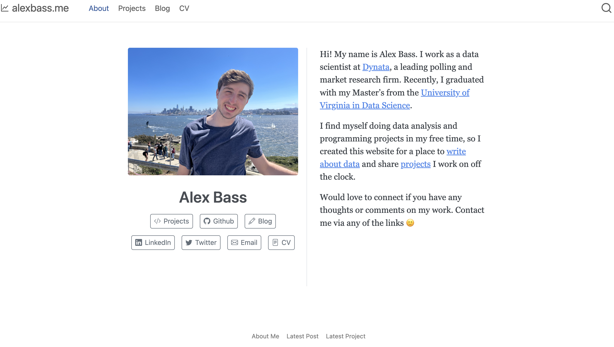

## My Personal Portfolio/Blog Site

I originally used RMarkdown and Blogdown to create my site, but have since switch to quarto which has several valuable features with minimal coding implementation. I use Netlify to deploy my site which is free. I, however, choose to pay a subscription for my personal domain name `alexbass.me`.

Here are a few features I like about my Quarto Website:

1. The quarto site seems more mobile friendly out of the box than blogdown. For example, the landing page looks completely different on mobile vs desktop. On mobiles, there is a nice list of links for the user to choose from followed by an "about me" description. While on desktop, this info displayed neatly side by side.
2. The listing pages are beautiful and customizable. I have a listing page for my blogposts which are stacked on top of each other thinly with a small amount of info for each item. I also have a projects listing page which as made up of project tiles. These work great for me.
3. I appreciate the ease of using python and R (julia and JS too though I haven't experimented with these much). I can use multiple languages in one document and pass data. I like making graphics in R and I often process data in python. So this setup is very nice for me.

Feel free to clone and use my site template and please reach out with comments or questions. Thanks!
